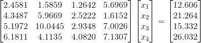
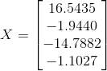
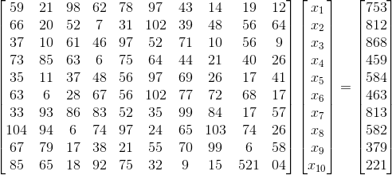
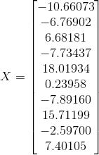
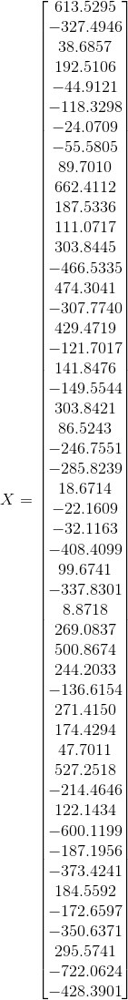

# Gauss - Jordan

## Introducción y antecedentes
Es un algoritmo del álgebra lineal para determinar las soluciones de un sistema
de ecuaciones lineales, encontrar matrices e inversas. Es llamado así debido a
Carl Friedrich Gauss y Wilhelm Jordan. Es una variación del método de
eliminación gaussina, la principal diferencia consiste en que en el método de
Gauss-Jordan cuando se elimina una incógnita no sólo se elimina de las
ecuaciones siguientes sino de todas las otras equaciones. De esta forma el paso
de eliminación genera una matriz identidad o una matriz escalonada reducida por
filas.

## Requisitos
Para que el método de Gauss-Jordan funcione la matriz de coeficientes tiene que
ser una matriz cuadrada.

## Diferencias a Eliminación Gaussiana
Como ya se mencionó anteriormente la principal diferencia consiste en que en el
método de Gauss-Jordan cuando se elimina una incógnita no sólo se elimina de las
ecuaciones siguientes sino de todas las otras equaciones.

## Diagrama de flujo


## ¿Es un método iterativo?
No es un método iterativo, es un método directo. esto se refiere a que es un
procedimeinto para calcular la solución a partir de una forma que es
matemáticamente exacta (no require de hacer aproximaciones con prueba y error continuamente),
además los métodos directos proporcionan una respuesta en un número fijo de pasos,
y sólo estan sujetos a errores de redondeo.

## script
```matlab
function [ X ] = gj( A, b )

C=[A b]; % Matriz aumentada
m = length(C(:,1))

for i=1:m
  if C(i,i) ~= 1
      C(i,:)= C(i,:) ./ C(i,i);  % divide toda la fila por C(i,i)
  end

  for n=1:m
    if n ~= i
        C(n,:) = -C(n,i) .* C(i,:) + C(n,:); % Entonces se convierte a 0
    end
  end
end

X = C(:, end);
end  % gj
```

## Qué es pivoteo
- Escalamiento:
  + Consiste en multiplicar un renglón por una constante, diferente de cero, que
    que llamamos factor de escalamiento del renglón.
- Pivoteo:
  + En algebra lineal el pivote o elemento delantero de un renglón de una matriz es
    el primer elemento a la izquierda que no es cero en ese renglón.
  + Pivoteo se refiere al cambio de pivote de las filas.

## Pruebas y resultados con sistemas de más de 3 incógnitas
### Prueba con 4 incógnitas




### Prueba con 10 incógnitas




### Prueba con 50 incógnitas
La matriz de coeficientes es demasiado grande como para mostrarla, pero aquí
está el resultado.


## Casos de falla
Si alguno de los elementos en la diagonal de la matriz de coeficientes es 0
entonces se produce una división entre 0.
Por ejemplo, si modificamos nuestra primera prueba (la de cuatro incógnitas)
de tal forma que A(2, 1) = A(2, 2) = 0 obtenemos como resultado NaN y un mensaje
que nos advierte que estamos intentando dividir entre 0.

## Conclusiones
En conclusión podemos decir que la eliminación de Gauss–Jordan nos son útiles en
la resolución de ecuaciones lineales, para ecuaciones no lineales no aplica este método.

El método de eliminación de Gauss-Jordan nos brinda un resultado más preciso y
al aplicar las operaciones resultan ser más sencillas a comparación de otros métodos.
