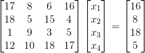
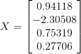
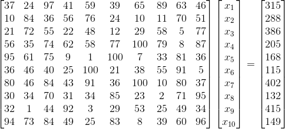
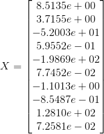
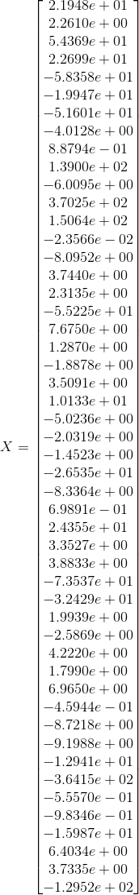

# Eliminación Gaussiana

## Introducción y antecedentes
Eliminación Gaussiana es un método discreto para resolver sistemas de
ecuaciones lineales de la forma A · X = B, donde A es una matriz de
coeficientes, X es un vector columna de incógnitas y B es un vector columna
de terminos independientes.

En general, propone la eliminación de variables en un sistema de ecuaciones,
hasta tener sólo una ecuacion con una incógnita. Una vez resuelta esta, se
procede por sustitución hacia atrás hasta obtener los valores de todas las
incógnitas.

El proceso consta de dos pasos:

a. Triangulación
  - Consiste en transformar el sistema original (la matriz A) en una
    triangular superior.

b. Sustitución hacia atrás
  - Consiste en despejar las incógnitas desde la última ecuación
    transformada (la última fila de A y B) hasta la primera ecuación
    transformada.


## Requisitos
La matriz de coeficientes A debe ser cuadrada.

## Diferencias a Gauss-Jordan
Como ya se mencionó anteriormente el método de eliminación gaussiana funciona
eliminando progresivamente el número de incógnitas en cada ecuación,
transformando la matriz de coeficientes en una matriz triangular superior.
El método de Gauss-Jordan continúa el proceso de transformación hasta obtener
una matriz diagonal unitaria, de tal forma que x_i = B_i/ A_i, i.


## Diagrama de flujo


## ¿Es un método iterativo?
No es un método iterativo, es un método directo. esto se refiere a que es un
procedimeinto para calcular la solución a partir de una forma que es
matemáticamente exacta (no require de hacer aproximaciones con prueba y error continuamente),
además los métodos directos proporcionan una respuesta en un número fijo de pasos,
y sólo estan sujetos a errores de redondeo.

## Script
  ```matlab
  function [ X ] = ge( A, b )
  % ge: Gaussian Elimination
  %
  % A method for solving matrix equations of the form Ax = b.

  [n m] = size(A);

  if n ~= m
    error('A must be a square matrix');

  elseif n ~= size(b)(1)
    error('A and b sizes do not match');
  end

  X = zeros(size(A)(1), 1);

  Aug = [A b];

  % Matrix triangulation
  for i=1:n
    temp = Aug(i:end,i:end);
    m = temp(2:end, 1) ./ temp(1);
    temp(2:end, :) = (temp(2:end, :) - m * temp(1, :));
    Aug(i:end,i:end) = temp;
  end

  X(end) = b(end) ./ Aug(end);

  % Backward substitution
  for i=n-1:-1:1
    X(i) = (b(i) - sum(-(Aug(i+1:end,i) .* X(i+1:end)))) ./ Aug(i, i);
  end

  end % ge
  ```

## Escalamiento y pivoteo
- Escalamiento:
  + Consiste en multiplicar un renglón por una constante, diferente de cero, que
    que llamamos factor de escalamiento del renglón.
- Pivoteo:
  + En algebra lineal el pivote o elemento delantero de un renglón de una matriz es
    el primer elemento a la izquierda que no es cero en ese renglón.
  + Pivoteo se refiere al cambio de pivote de las filas.

## Qué es triangualción
Consiste en obtener la matriz triangulada de una matriz operando con las filas.
Las operaciones que podemos se pueden hacer son:

1. Intercambiar dos filas.
2. Sustituir una fila por sí misma multiplicada por un número distinto de cero.
3. Sustituir una fila por sí misma multiplicada por un número distinto de cero y
sumada o restada a otra fila también multiplicada por un número distinto de cero.

## Pruebas y resultados con sistemas de más de 3 incógnitas

### Sistema con 4 incógnitas




### Sistema con 10 incógnitas




### Sistema con 50 incógnitas
La matriz de coeficientes es demasiado grande como para mostrarla, pero aquí está el resultado:


## Casos de falla
Si durante el cálculo de la matriz triangular superior alguno de los elementos
de la diagonal resulta ser 0 se producirá una división entre 0 devido a la linea
20 del código.

Por ejemplo, si modificamos nuestra primera prueba (la de cuatro incógnitas)
de tal forma que A(2, 1) = A(2, 2) = 0 obtenemos como resultado NaN y un mensaje
que nos advierte que estamos intentando dividir entre 0.

## Conclusiones
El método de eliminación gaussiana es muy robusto, nos son útiles en
la resolución de ecuaciones lineales,
para ecuaciones no lineales no aplica este método.
Las desventajas son que podría no encontrar la solución por una división entre cero.
