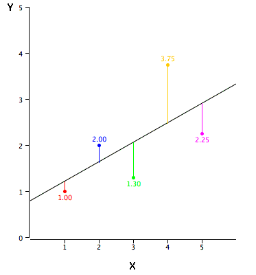
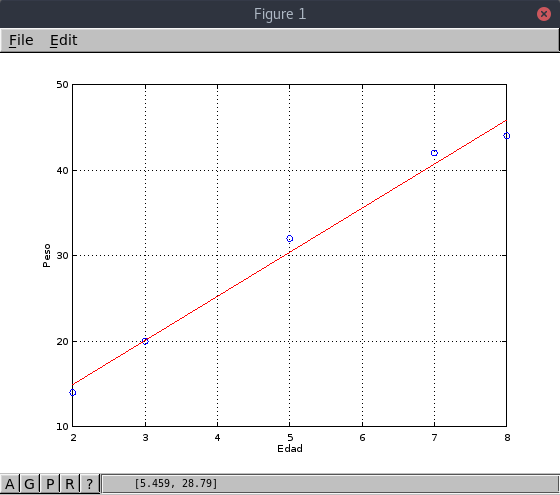
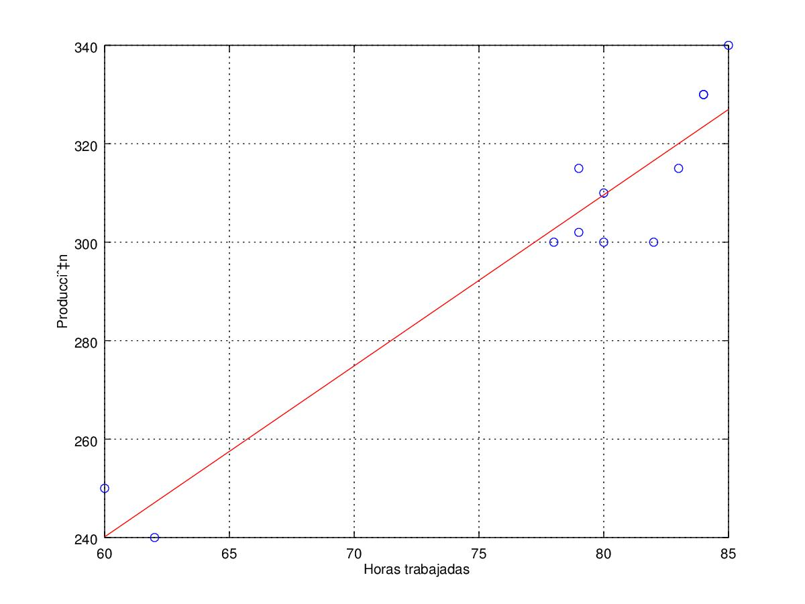
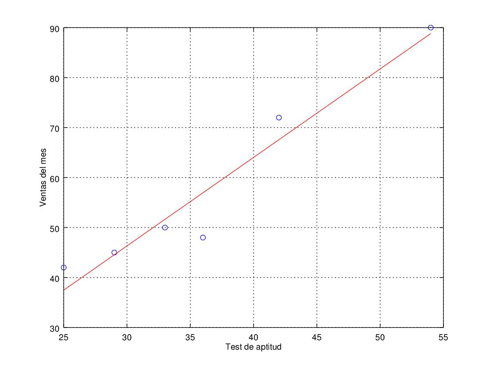

# Regresión lineal

## Antecedentes
El análisis de regresión es una técnica de modelado predictivo que investiga la
relación entre una **variable dependiente** y una **variable independiente**.
Es una herramienta importante en modelado y análisis de datos. Tratamos de
ajustar una curva o línea a la nube de datos de tal manera que las diferencias
entre las distancias de la nube de datos a la curva o línea sea mínima.
La regresión lineal es un modelo matemático usado para aproximar la relación de
dependencia entre una variable dependiente y variables independientes.
Hay innumerables formas de regresión, cada una tiene sus condiciones y
situaciones especificas donde aplican mejor que otras.

## Justificación y propósito
Como mencioné anteriormente, el análisis de regresión estima la relación entre
dos o más variables. Los beneficios de usar regresión son:
- Indica la relación significativa entre variable dependiente e independiente.
- Indica la fuerza de impacto de multiples variables independientes en una
  variable dependiente.

## Fundamento matemático con gráficos
La regresión lineal se representa con una ecuación de la forma **Y = a + b*X + e**,
donde a es la intercepción, b es la pendiente de la linea y e es un termino de error.
Esta ecuación se puede utilizar para predecir el valor de la variable dependiente
basado en la(s) variable(s) predictoras.

Para obtener la linea que mejor se ajusta a los datos (es decir, obtener a y b),
podemos usar el método de los mínimos cuadrados. Es el método más común usado
para ajustar una linea de regresión. Este calcula la linea a partir de los datos
observados minimizando la suma de los cuadrados de las desviaciones verticales
desde cada punto a la linea, debido a que las desviaciones están elevadas al
cuadrado, no se cancelan valores positivos y negativos cuando son sumadas.

Podemos aplicar regresión lineal a cualquier nube de datos pero hay que
considerar que podría haber otro modelo predictivo que se ajuste mejor.
Además es importante notar que la regresión lineal es sensible a *Outliers*,
estos son, puntos que introducen ruido en nuestros datos debido a que no se
ajustan bien al modelo e introducen mucho error, modificando la aproximación.

## Diagrama de flujo

## Ejemplos resueltos con gráficos y cuantificación del error
1. Cinco niños de 2, 3, 5, 7 y 8 años de edad pesan, respectivamente, 14, 20, 32, 42 y 44 kilos.

| Edad | Peso |
| :------------- | :------------- |
| 2 | 14 |
| 3 | 20 |
| 5 | 32 |
| 7 | 42 |
| 8 | 44 |

Standard error: 1.69161

Determination coefficient: 0.987722

Correlation coefficient: 0.993842

Equation: Y = 4.630769 + 5.153846 * X

2. A partir de los siguientes datos referentes a horas trabajadas en un taller (X), y a unidades producidas (Y), determinar la recta de regresión de Y sobre X, el coeficiente de correlación lineal e interpretarlo.

| Horas | Producción |
| :------------- | :------------- |
| 80 | 300 |
| 79 | 302 |
| 83 | 315 |
| 84 | 330 |
| 78 | 300 |
| 60 | 250 |
| 82 | 300 |
| 85 | 340 |
| 79 | 315 |
| 84 | 330 |
| 80 | 310 |
| 62 | 240 |

Standard error: 9.46644

Determination coefficient: 0.910105

Correlation coefficient: 0.953994

Equation: Y_guess = 31.741135 + 3.473404 * X

3. La tabla siguiente nos da las notas del test de aptitud (X) dadas a seis dependientes a prueba y ventas del primer mes de prueba (Y) en cientos de euros.

| Test | Ventas del mes |
| :------------- | :------------- |
| 25 | 42 |
| 42 | 72 |
| 33 | 50 |
| 54 | 90 |
| 29 | 45 |
| 36 | 48 |

Standard error: 5.57802

Determination coefficient: 0.931195

Correlation coefficient: 0.964984

Equation: Y_guess = -6.780155 + 1.770233 * X

