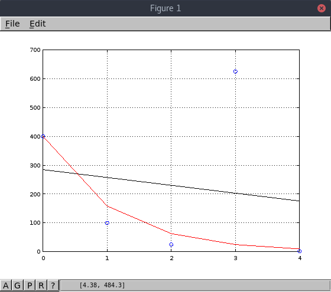
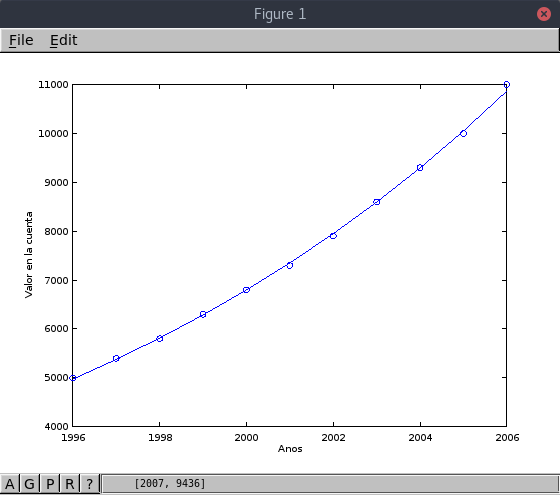
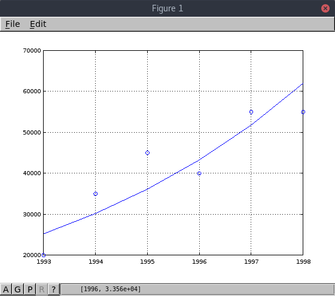
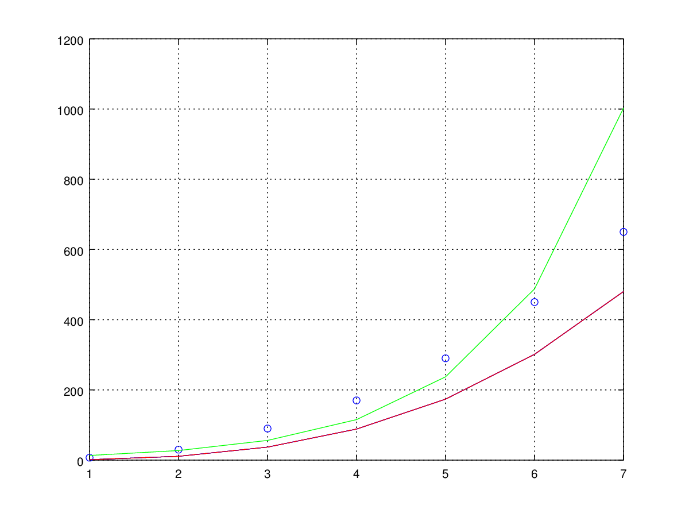
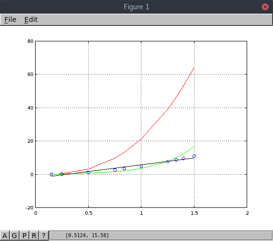

# Regresión lineal

## Antecedentes
El análisis de regresión es una técnica de modelado predictivo que investiga la
relación entre una **variable dependiente** y una **variable independiente**.
Es una herramienta importante en modelado y análisis de datos. Tratamos de
ajustar una curva o línea a la nube de datos de tal manera que las diferencias
entre las distancias de la nube de datos a la curva o línea sea mínima.
La regresión lineal es un modelo matemático usado para aproximar la relación de
dependencia entre una variable dependiente y variables independientes.
Hay innumerables formas de regresión, cada una tiene sus condiciones y
situaciones especificas donde aplican mejor que otras.

## Justificación y propósito
Como mencioné anteriormente, el análisis de regresión estima la relación entre
dos o más variables. Los beneficios de usar regresión son:
- Indica la relación significativa entre variable dependiente e independiente.
- Indica la fuerza de impacto de multiples variables independientes en una
  variable dependiente.

## Fundamento matemático con gráficos
La regresión lineal se representa con una ecuación de la forma **Y = a + b*X + e**,
donde a es la intercepción, b es la pendiente de la linea y e es un termino de error.
Esta ecuación se puede utilizar para predecir el valor de la variable dependiente
basado en la(s) variable(s) predictoras.

Para obtener la linea que mejor se ajusta a los datos (es decir, obtener a y b),
podemos usar el método de los mínimos cuadrados. Es el método más común usado
para ajustar una linea de regresión. Este calcula la linea a partir de los datos
observados minimizando la suma de los cuadrados de las desviaciones verticales
desde cada punto a la linea, debido a que las desviaciones están elevadas al
cuadrado, no se cancelan valores positivos y negativos cuando son sumadas.

Podemos aplicar regresión lineal a cualquier nube de datos pero hay que
considerar que podría haber otro modelo predictivo que se ajuste mejor.
Además es importante notar que la regresión lineal es sensible a *Outliers*,
estos son, puntos que introducen ruido en nuestros datos debido a que no se
ajustan bien al modelo e introducen mucho error, modificando la aproximación.

## Diagrama de flujo

## Ejemplos resueltos con gráficos y cuantificación del error
1. Cinco niños de 2, 3, 5, 7 y 8 años de edad pesan, respectivamente, 14, 20, 32, 42 y 44 kilos.

| Edad | Peso |
| :------------- | :------------- |
| 2 | 14 |
| 3 | 20 |
| 5 | 32 |
| 7 | 42 |
| 8 | 44 |

Standard error: 1.69161

Determination coefficient: 0.987722

Correlation coefficient: 0.993842

Equation: Y = 4.630769 + 5.153846 * X

2. A partir de los siguientes datos referentes a horas trabajadas en un taller (X), y a unidades producidas (Y), determinar la recta de regresión de Y sobre X, el coeficiente de correlación lineal e interpretarlo.

| Horas | Producción |
| :------------- | :------------- |
| 80 | 300 |
| 79 | 302 |
| 83 | 315 |
| 84 | 330 |
| 78 | 300 |
| 60 | 250 |
| 82 | 300 |
| 85 | 340 |
| 79 | 315 |
| 84 | 330 |
| 80 | 310 |
| 62 | 240 |

Standard error: 9.46644

Determination coefficient: 0.910105

Correlation coefficient: 0.953994

Equation: Y_guess = 31.741135 + 3.473404 * X

3. La tabla siguiente nos da las notas del test de aptitud (X) dadas a seis dependientes a prueba y ventas del primer mes de prueba (Y) en cientos de euros.

| Test | Ventas del mes |
| :------------- | :------------- |
| 25 | 42 |
| 42 | 72 |
| 33 | 50 |
| 54 | 90 |
| 29 | 45 |
| 36 | 48 |

Standard error: 5.57802

Determination coefficient: 0.931195

Correlation coefficient: 0.964984

Equation: Y_guess = -6.780155 + 1.770233 * X

# Linealización de modelos no lineales
Algunas veces la regresión lineal puede ser usada en relaciones que no son
inherentemente lineales, después de aplicar una transformación.

## Regresión exponencial
Consideramos el siguiente modelo exponencial: y = a*exp(b * x).

Aplicando el logaritmo natural a ambos lados de la ecuación tenemos la siguiente
ecuación equivalente: ln(y) = ln(a) + b * x.

Esta ecuación tiene la forma de un modelo de regresión lineal: y' = a' + b * x

## Regresión potencial
Otro modelo de regresión no lineal es el modelo de regresión potencial, que se basa en la siguiente ecuación: y = a * x ^ b

Aplicando logaritmo a ambos lados de la ecuación, tenemos:
log(y) = log(a) + b * log(x)

Esta ecuación tiene la forma de un modelo de regresión lineal: y' = a' + b * x'

## Ejemplos

Con estos datos podemos apreciar en la gráfica de abajo que el modelo exponencial
(en rojo) se ajusta mucho mejor a los datos que el modelo lineal (en negro).
Cabe destacar que las regresiones están siendo afectadas por el Outlier que está
en (3, 625).

| X | Y |
| :------------- | :------------- |
| 0 | 400 |
| 1 | 100 |
| 2 | 25 |
| 3 | 625 |
| 4 | 1.5625 |

Equation: Y_guess = exp(5.991465) \* exp(-0.925777 \* X)

Standard error: 348.836

Determination coefficient: -0.233174

Correlation coefficient: 0.482881

En este segundo caso el modelo que mejor se acerca es también el exponencial,
ajustandose casi perfectamente a los datos.

| X	| Y |
| :---- | :---- |
| 1996	| 5000 |
| 1997	| 5400 |
| 1998	| 5800 |
| 1999	| 6300 |
| 2000	| 6800 |
| 2001	| 7300 |
| 2002	| 7900 |
| 2003	| 8600 |
| 2004	| 9300 |
| 2005	| 10000 |
| 2006	| 11000 |

Equation: Y_guess = exp(-147.463576) * exp(0.078144 * X)

Standard error: 54.522

Determination coefficient: 0.999313

Correlation coefficient: 0.999656

En este tercer ejemplo el modelo exponencial se ajusta bien a los datos, a pesar
de que estos esten más dispersos.

| X	| Y |
| :---- | :---- |
| 1993	| 20000 |
| 1994	| 35000 |
| 1995	| 45000 |
| 1996	| 40000 |
| 1997	| 55000 |
| 1998	| 55000 |

Equation: Y_guess = exp(-348.387392) \* exp(0.179891 \* X)

Standard error: 7048.29

Determination coefficient: 0.775211

Correlation coefficient: 0.880461

En este cuarto ejemplo no es muy claro cuál de los dos modelos se ajusta mejor,
sería necesario tener más datos para poder dar una respuesta acertada.

| X	| Y |
| :---- | :---- |
| 1	| 7 |
| 2	| 30 |
| 3	| 90 |
| 4	| 170 |
| 5	| 290 |
| 6	| 450 |
| 7	| 650 |

#### Con regresión potencial (rojo):

Equation: Y_guess = 10^0.127025 \* X.^3.022645

Standard error: 121.887

Determination coefficient: 0.781831

Correlation coefficient: 0.884212

#### Con regresión exponencial (verde):

Equation: Y_guess = exp(1.865637) \* exp(0.720691 \* X)

Standard error: 162.971

Determination coefficient: 0.609981

Correlation coefficient: 0.781013

En este quinto ejemplo los datos están mucho menos dispersos y casi podría ajustarse
una linea de regresión (en negro). el modelo potencial (en rojo) no es para nada adecuado.
Parace que el modelo exponencial (en verde) se alejariía cada vez más al predecir valores
para x > 1.5.

| X	| Y |
| :---- | :---- |
| 1	| 7 |
| 2	| 30 |
| 3	| 90 |
| 4	| 170 |
| 5	| 290 |
| 6	| 450 |
| 7	| 650 |

#### Modelo exponencial (verde)

Equation: Y_guess = exp(1.865637) * exp(0.720691 * X)

Standard error: 162.971

Determination coefficient: 0.609981

Correlation coefficient: 0.781013

#### Modelo potencial (rojo)

Equation: Y_guess = 10^0.127025 * X.^3.022645

Standard error: 121.887

Determination coefficient: 0.781831

Correlation coefficient: 0.884212

#### Modelo lineal (negro)

Standard error: 71.6407

Determination coefficient: 0.92463

Correlation coefficient: 0.961577

Equation: Y_guess = -183.142857 + 106.035714 * X

