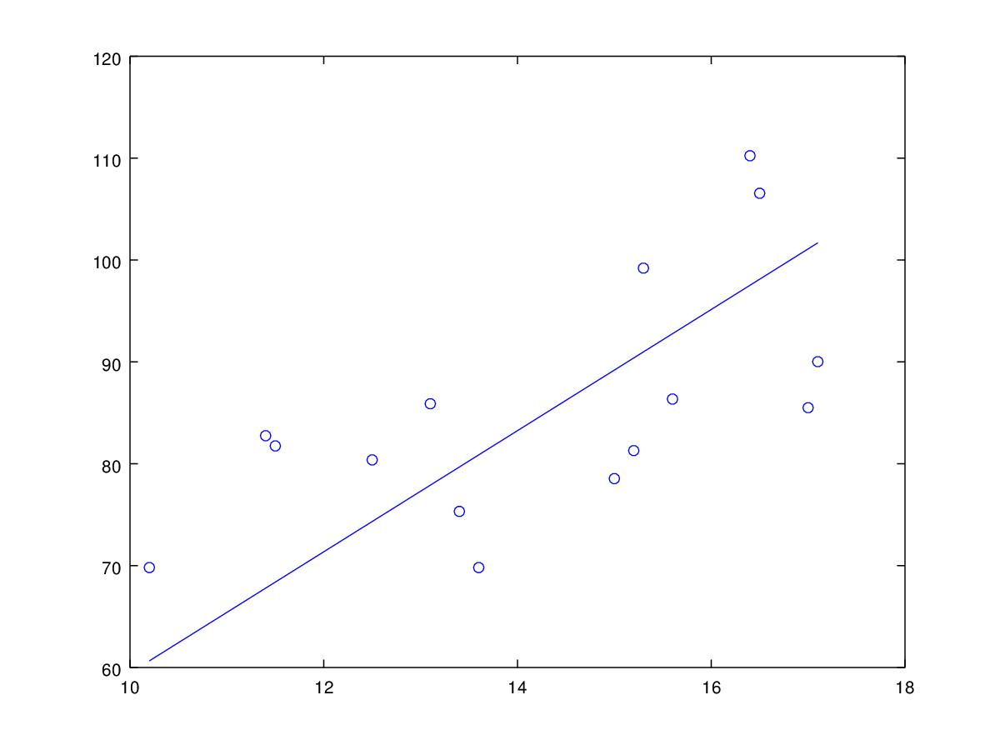

# regresión lineal

En quince casas de la ciudad se observó durante un período de tiempo la diferencia de temperatura promedio (en grados centígrados) entre la temperatura en la calle y la temperatura en casa, y el consumo de electricidad diario en kWh

## Graficas de datos


Podemos percibir que entre más sube la diferencia de temperatura entre la casa y la calle
suele haber más consumo de energía eléctrica.

## Aplique regresión lineal y obtenga la función lineal que se ajusta a estas mediciones.

corriendo el siguiente código con los datos proporcionados obtenemos los resuldatos de a1 = 3.39553	a0 = 37.1618, lo que quiere decir que el y = 37.1618 + 3.39553 * x es un modelo lineal que se ajusta apropiadamente a estos datos.

```cpp
#include <iostream>
#include <fstream>
#include <cmath>

using namespace std;

double *linear_regression(unsigned n, string x_file, string y_file) {
  double s_x, s_y, s_x2, s_p, mu_x, mu_y, std_x, std_y, std_xy, a0, a1;

  double *xs = (double *) calloc(n, sizeof(double));
  double *ys = (double *) calloc(n, sizeof(double));

  ifstream x_stream(x_file);
  ifstream y_stream(y_file);

  cout << "X" << "\t" << "y" << endl;
  cout << "----" << "\t" << "----" << endl;
  for (size_t i = 0; x_stream && y_stream && i < n; i++) {
    double x, y;
    x_stream >> x;
    y_stream >> y;

    xs[i] = x;
    ys[i] = y;

    s_x += x;
    s_y += y;
    s_x2 += x * x;
    s_p += x * y;

    cout << x << "\t" << y << endl;
  }

  x_stream.close();
  y_stream.close();

  mu_x = s_x / n;
  mu_y = s_y / n;

  for (size_t i = 0; i < n; i++) {
    std_x += pow(xs[i] - mu_x, 2);
    std_y += pow(ys[i] - mu_y, 2);
    std_xy += (xs[i] - mu_x) * (ys[i] - mu_y);
  }

  // standard deviation
  std_x = sqrt(std_x/n);
  std_x = sqrt(std_y/n);
  std_xy /= n;

  cout << "Error estandar x: " << std_x / sqrt(n) << ", y: " << std_y / sqrt(n) << endl;
  cout << "Coeficiente de correlación: " << std_xy / (std_x * std_y) << endl;

  a1 = (n * s_p - s_x * s_y) / (n * s_x2 - s_x * s_x);
  a0 = (mu_y - a1 * mu_x);

  cout << "a1: " << a1 << "\t" << "a0: " << a0 << endl;

  return new double[2] {a0, a1};
}

int main(int argc, char const *argv[]) {
  linear_regression(15, "temp_diff.txt", "kWh.txt");

  return 0;
}
```

**FIN**
## Error estándar de la estimación
El error estandar está definido por la desviación estandar entre la raíz del numero
de datos: std_dev / sqrt(n). Así pues, encontramos que el error estandar de la
estimación es de 509.583.

## Coeficiente de correlación
El coeficiente de correlación de Pearson es una medida de relación lineal entre dos variables aleatorias
cuantitativas y lo podemos utilizar como índice para medir el grado de relación de dos variables.


Encontramos que el coeficiente de correlación en los datos es de -6.81036e+31.

## Grafica de la regresión lineal


## Conclusiones
