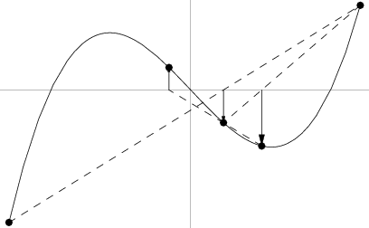

# Método Secante

El método de la secante es un algoritmo para encontrar la raíz de una función
que se asume que es aproximadamente lineal en la región de interés. Cada
aproximación se toma como el punto donde la linea secante corta el eje x.



## En qué consiste

Se basa en obtener la ecuación de la recta que pasa por los puntos (x_i-1, f(x_m.1)) y
(x_i, f(x_i)). A dicha recta se le llama secante por cortar la gráfica de la función.
Posteriormente se escoge como siguiente elemento de la relación de recurrencia x_i+1,
la intersección de la recta secante con el eje de las abscisas obteniendo la fórumula y
un nuevo valor. A continuación continuamos con este proceso, hasta llegar a un
nivel de precisión suficientemente alto (una diferencia suficientemente pequeña
  entre x_n y x_n-1).

Se basa en la fórmula de Newton-Raphson, pero evita el cálculo de la derivada
usando la siguiente aproximación:

  **f'(x) ≈ (f(x_i-1) - f(x_i)) / (x_i-1 - x_i)**

Sustituyendo en la fórmula de Newton-Raphson obtenemos:

  **x_i+1 = x_i - f(x_i)/f'(x_i) ≈ x_i - (f(x_i) * (x_i-1 - x_i) / f(x_i-1) - f(x_i))**

## Requisitos previos
Es importante notar que para poder calcular la siguiente
aproximación x_i+1 necesitamos conocer las dos aproximaciones anteriores,
x_i y x_i-1.

## Diagrama de flujo


## Criterio de detención del método
El método de la secante se detendrá cuando el error iterativo (ε) sea lo suficientemente
pequeño, para lograr un nivel de precisión lo suficientemente aceptable.

Cabe destacar que el orden de convergencia en un punto cercano a la solución es φ (número áureo). En caso de que la aproximación inicial sea demasiado lejana o la raíz no sea simple,
este método no asegura la convergencia.

## Código fuente

```cpp
#include <cmath>

#ifndef MINERR
#define MINERR 1E-6
#endif

typedef double (* vFunctionCall)(double x);

double secante(vFunctionCall fun, double x1, double x2) {
  double x0;
  int i = 0;
  do {
    x0=x1;
    x1=x2;
    x2 = x1 - (x1-x0) * fun(x1) / (fun(x1) - fun(x0));
    // if (fun(x2) == 0) {
    //   return x2;
    // }
    i++;
  } while ( fabs (x1-x2) > MINERR );

  fprintf(stderr, "Iteraciones: %d\n", i);
  fprintf(stderr, "Error: %f\n", fabs(x1 - x2));
  return x2;
}
```

## Pruebas y resultados
- Casos de exito:

| f(x) | x_1 | x_2 | iteraciones | Resultado |
| :------------- |:------ | :------ | :---- | :------------- |
| x ^ 2 - 4 | 1 | 5 | 9 | 2 |
| x ^ 2 - 4 | -100 | -101 | 15 | -2 |
| atan(x) | 1 | 8 | 9 | 0 |
| cos(3 * x) - x | -1.39174 | -1.39174 | 11 | -0.979367 |

- Casos frontera:

| f(x) | x_1 | x_2 | iteraciones | Resultado |
| :------------- |:------ | :------ | :---- | :------------- |
| x ^ (1/3) | 1 | 0 | 1 | 0 |
| x ^ 3 - x - 11 | -10 | 5 | 10 | 2.373650 |

- Casos de falla:

| f(x) | x_1 | x_2 | iteraciones | Resultado |
| :--------- |:------ | :------ | :---- | :------------- |
| x ^ (1/3) | -20 | 20 | 1 | -nan |
| x ^ 3 - x - 11 | -100 | 100 | 132415 | -nan |

## Conclusiones
El método de la secante es un método abierto que podemos aplicar cuando la función *f(x)* es demasiado compleja como para obtener su derivada (que se usaría en el método de Newton-Raphson).
Es decir: si *f(x)* es tan compleja que es dispendioso obtener f'(x), es mejor usar
el método de la secante. Empero, su velocidad de convergencia es menor que la de otros
métodos como Newton-Raphson, y además dicha convergencia no se asegura si la primera
aproximación a la raíz no es lo suficientemente cercana a ella, ni tampoco se
asegura cuando la raíz es múltiple, en dados casos nos arriesgamos a que el método
no converja y no podamos encontrar la raíz.
